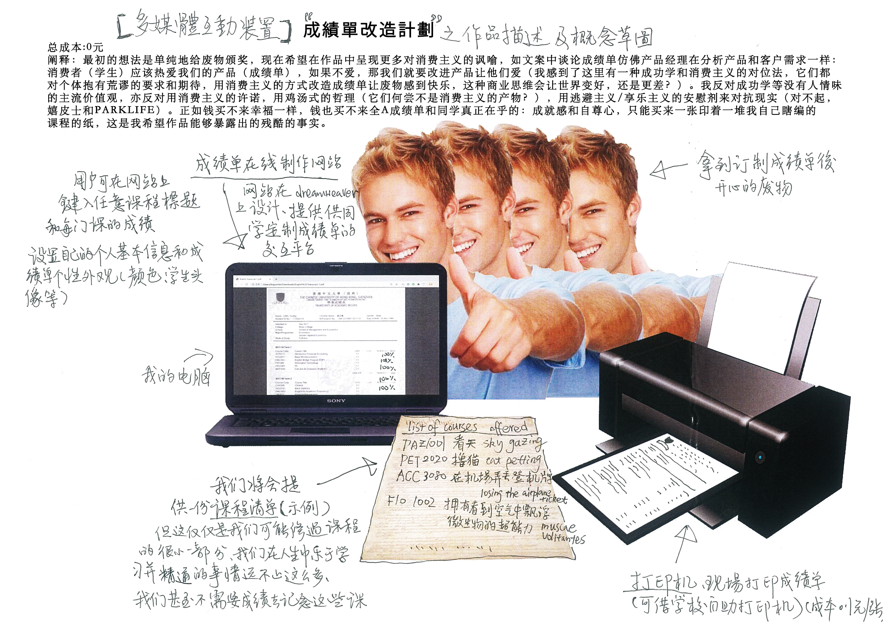

艺术家：龙虾长者

作品阐释：

学生需用自己的香港中文大学（深圳）内网个人账号及密码进入学生信息系统（SIS）（由甲骨文(Oracle)公司提供的数据库服务器）经数次点击（每次耗时约3秒）切换多个界面前往正式成绩单申请系统，学生将有机会索要一份成绩单（可选择邮寄到家或前往教务处面提，可选择两种语言版本（英文40元一份，中文20元一份，价钱多少由大四生对成绩单的刚性需求和教务处对其生产的垄断地位决定，根据教务处内部人士的可靠情报，成本约为5元一份，多少由中国居民消费价格指数（CPI）决定））。由于SIS的不稳定性及20分钟后自动掉线的信息安全机制，在线申请成绩单的全部操作时间不宜超过20分钟。假设学生勾选了“自提”，经3-5工作日（不含法定节假日）后学生的申请状态将由“承索”（这个词在现代汉语词典中查不到，在广东话中是绳子的意思，据我猜测它的含义接近于它的英文官方翻译，在括号中给出：（on request））变为“已完成”，这标志着教务处老师终于看到了学生的成绩单申请并按下了打印按钮，学生此时可携带学生卡（ student ID）前往教务处（位于TB101，电话：(86 755) 8427 3626，办公时间：周一至周五 8:30 - 12:00; 13:00 - 17:30）领取。成绩单上有一些关于学生的重要信息，提醒学生他/她的性别、出生日期，学什么专业等，除此之外上面大部分内容是该学生修过的课程清单，有一些听起来不错的课程标题，比如“舌尖上的社会学”（To Eat, or Not to Eat? Sociology of Food），也有一些标题让人困惑，比如“射频集成电路”（Radio Frequency Integrated Circuits），大部分课程标题只是单纯让学生没有想深入了解的欲望，比如“逻辑”、”中级计量经济学“、”长篇翻译项目“等。尽管价格昂贵，购买渠道单一，学生无法定制自己成绩单的颜色、字体、外观、课程的标题、标题后面的字母等种种设计元素。据调查，成绩单产品的单调僵化已造成潜在的成绩单忠实客户流失，越来越多的学生丧失了努力学习购买成绩单的积极性，某些学生甚至表现出不愿意展示成绩单，撕毁成绩单的反常行为。除此之外，每张成绩单背面均是同样的用黄字印刷的成绩特别说明，这种浪费大量纸张印刷相同信息的做法饱受校内环保团体的诟病。

据此，我们将改良成绩单的申请流程和内容设计，推出一款全新的划时代的成绩单产品，让每一个同学重新爱上成绩单。

